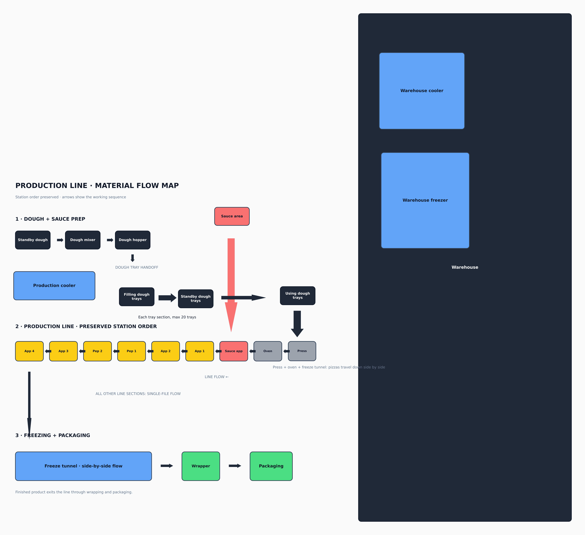

# Production Run Calculator

[](https://github.com/ravenslight2010/Production-run-calculator/actions/workflows/ci.yml)

Pizza production planning, scheduling, and inventory for floor staff — available as a web app and a mobile app.

The system plans a day's pizza production line (runs, dough, sauce, cheese, ingredients), tracks inventory consumption, schedules staff-facing work, and pairs the operational data with AI-assisted issue diagnosis and manager alerts.

## Stack

- pnpm workspaces · Node.js 24 · TypeScript 5.9
- Web: React 19 + Vite (Tailwind v4)
- Mobile: Expo / React Native (Expo Router)
- API: Express 5, validated with Zod (`zod/v4` + `drizzle-zod`)
- DB: PostgreSQL + Drizzle ORM
- API contract: OpenAPI spec — regenerated hooks (`@workspace/api-client-react`) and Zod schemas (`@workspace/api-zod`)

## Repository layout

| Path | What it is |
| --- | --- |
| `artifacts/run-calculator` | Web app (React + Vite). Most UI/logic lives in `src/pages/home.tsx`. |
| `artifacts/run-calculator-mobile` | Mobile app (Expo / React Native), local-only state in `app/RunContext.tsx`. |
| `artifacts/api-server` | Express 5 API server; routes in `src/routes/*` (~70 files, `ai*` prefixes are AI endpoints). |
| `artifacts/mockup-sandbox` | Development-only mockup sandbox (not production). |
| `lib/api-spec` | OpenAPI contract (source of truth) + codegen. |
| `lib/db` | Drizzle schema (source of truth) + migrations/push. |
| `lib/*` | Shared pure logic packages (inventory math, spec import, recipe apply, production rules, allergen, voice commands, merge suggest, …). |
| `attached_assets/source-library` | Customer's complete source workbooks (specs, dough/sauce procedures, cheese/premix/shipping/schedule) + audit reports. |
| `.agents/memory` | Institutional knowledge: sharp edges, sync semantics, auth boundaries, schema rules, etc. Read before touching an unfamiliar area. |

## Quick start (Docker)

```bash
cp .env.docker.example .env   # fill in secrets (DB password, sign-up code, AI key)
docker compose up --build
```

- Web is served by Caddy on `:80`/`:443` (auto-HTTPS via `SITE_ADDRESS`).
- API runs on port `5000`; schema is applied by the one-shot `migrate` service (`db push-force`).
- The API image is built from the slim `api` target. The Compose `migrate`
  service uses the full `api-migrate` target and must complete before `api`
  starts.

### Container deployment and rollback

CI publishes two API images:

- `runcalc-api:<sha>` — slim production runtime serving `/` and `/api/*`.
- `runcalc-api-migrate:<sha>` — full workspace image for one-shot
  `@workspace/db` `push-force` operations.

Render deploys `runcalc-api` and runs the bundled Drizzle Kit command as its
pre-deploy migration. For a manual migration or a self-hosted deployment, run
the `api-migrate` target (or the matching `runcalc-api-migrate:<sha>` image)
against the deployment database before starting the runtime image. Do not
point the long-lived API service at the migration image.

Use immutable GHCR tags, never `latest`, for a deployment or rollback. For
example, first apply the migration image that exactly matches the release being
introduced, then start its matching runtime:

```bash
docker run --rm --env DATABASE_URL="$DATABASE_URL" \
  ghcr.io/ravenslight2010/runcalc-api-migrate:<new-sha>
docker run ... ghcr.io/ravenslight2010/runcalc-api:<new-sha>
```

Verify both deployed checks: `/` must return the compiled calculator and
`/api/healthz` must report healthy. To roll application code back, replace only
the runtime with the earlier immutable tag:

```bash
docker run ... ghcr.io/ravenslight2010/runcalc-api:<previous-sha>
```

Do **not** run the previous migration image or attempt a down migration.
Database application is forward-only, so the earlier runtime must operate
against the schema already applied by
`runcalc-api-migrate:<new-sha>`. If either `/` or `/api/healthz` is
incompatible, stop the rollback and roll forward with a compatibility fix
instead. The CI rehearsal command is `pnpm run check:schema-safe-rollback`; it
proves this adjacent-revision code-only replacement using disposable Docker
resources. The retained [September 2026 rehearsal
evidence](docs/schema-safe-rollback-rehearsal-evidence.md) records a matching
migration exit, both deployment checks before and after replacement, immutable
image identities, and an unchanged normalized schema fingerprint.

## Local development

Prerequisites: Node.js 24, pnpm, a PostgreSQL 16 database.

```bash
pnpm install

# API server (port 5000)
pnpm --filter @workspace/api-server run dev

# Web app (Vite dev server)
pnpm --filter @workspace/run-calculator run dev

# Regenerate API hooks + Zod schemas from the OpenAPI spec
pnpm --filter @workspace/api-spec run codegen

# Push DB schema changes (dev only)
pnpm --filter @workspace/db run push
```

Required env for the API: `DATABASE_URL`. Security-relevant env: `STAFF_SIGNUP_CODE` (gates public sign-up, fails closed), `INITIAL_MANAGER_USERNAME` + `INITIAL_MANAGER_ACCESS_CODE` (bootstrap the first manager, fails closed).

## Verification

```bash
pnpm run typecheck        # full typecheck across all packages
pnpm run build            # typecheck + build all packages
```

- Verify with `typecheck`, not `build` — `build` needs workflow-provided `PORT`/`BASE_PATH` and can fail from a plain shell even when the code is fine.
- Tests run via configured workflows (`test`, `test:client`, `test:rules`, `test:inventory-math`, `test:corpus`); the corpus harness re-runs deterministic parses of the full source library against checked-in snapshots after importer changes.
- CI (GitHub Actions): typecheck, unit tests, API tests with a Postgres service, web/API builds, and a non-blocking security audit.
- Dependabot keeps npm dependencies patched; the pinned Expo (mobile) toolchain is excluded from auto-updates.

### Skill catalog maintenance

Run `pnpm run check:skill-catalog` to inventory the editable and managed skill
roots. The catalog contract treats `.agents/skills` and
`.local/custom_skills` as editable, and `.local/skills` and
`.local/secondary_skills` as platform-managed. Editable skills must have valid
kebab-case metadata, complete local references, and stay within the 500-line
guidance; managed-root findings are reported as non-blocking warnings because
 those files are platform-owned. Reviewed managed findings are tracked in
 `skill-catalog-managed-baseline.json`; new findings remain visibly
 undocumented warnings instead of blending into the reviewed inventory. The
 checker only follows local Markdown link targets in a
skill folder (`SKILL.md`, `./`, `../`, `references/`, `scripts/`, or `assets/`)
and ignores URLs, anchors, and other prose. Intentional cross-root duplicates
belong in `skill-catalog-allowlist.json` with an explicit routing target.

## Product

- Pizza production line planning, scheduling, and inventory for floor staff (web + mobile).
- AI issue diagnosis & manager alerts: any signed-in user can report an issue and get an immediate plain-language AI diagnosis plus a safe workaround; uncaught crashes are auto-captured and become server-side incidents with AI diagnosis.

### Production line layout

The approved floor-layout reference is available as a
[full-resolution PNG](docs/production-line/production-line.png).



## Document map

- `replit.md` — operational runbook (Replit workflows, reset flow, corpus harness, gotchas).
- `threat_model.md` — security threat model and trust boundaries.
- `.agents/memory/` — deep institutional knowledge (215+ notes on sync semantics, auth, imports, schema rules).
- `docker-compose.yml` / `Dockerfile` — containerized deployment.

## User preferences (current)

- **Web-only focus — mobile parity paused** (as of 2026-07-06). Do not do web+mobile parity work unless explicitly asked. When parity resumes, every behavior change must land in both apps with formulas matching exactly (most logic lives in `lib/*` for this reason).
