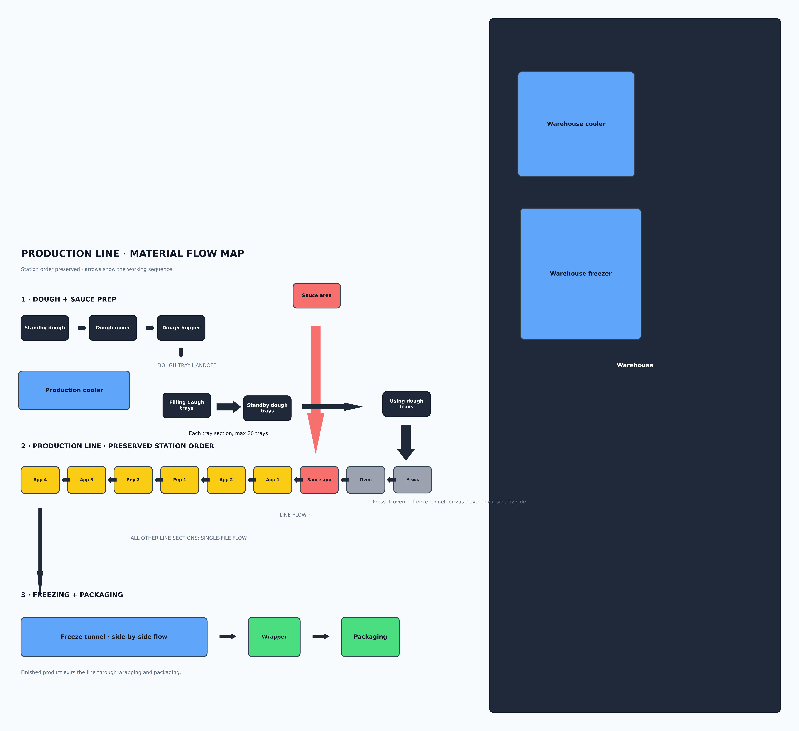

# Production Run Calculator

[](https://github.com/ravenslight2010/Production-run-calculator/actions/workflows/ci.yml)

Pizza production planning, scheduling, and inventory for floor staff — available as a web app and a mobile app.

The system plans a day's pizza production line (runs, dough, sauce, cheese, ingredients), tracks inventory consumption, schedules staff-facing work, and pairs the operational data with AI-assisted issue diagnosis and manager alerts.

The Replit deployment is the only authorized publisher of the active production
app. GitHub is used for source backup and CI/testing: GitHub pushes, releases,
workflow runs, test artifacts, and container builds do not publish the app or
prove what is live.

## Stack

- pnpm workspaces · Node.js 24 · TypeScript 5.9
- Web: React 19 + Vite (Tailwind v4)
- Mobile: Expo / React Native (Expo Router)
- API: Express 5, validated with Zod (`zod/v4` + `drizzle-zod`)
- DB: PostgreSQL + Drizzle ORM
- API contract: OpenAPI spec — regenerated hooks (`@workspace/api-client-react`) and Zod schemas (`@workspace/api-zod`)

## Repository layout

| Path | What it is |
| --- | --- |
| `artifacts/run-calculator` | Web app (React + Vite). Most UI/logic lives in `src/pages/home.tsx`. |
| `artifacts/run-calculator-mobile` | Mobile app (Expo / React Native), local-only state in `app/RunContext.tsx`. |
| `artifacts/api-server` | Express 5 API server; routes in `src/routes/*` (~70 files, `ai*` prefixes are AI endpoints). |
| `artifacts/mockup-sandbox` | Development-only mockup sandbox (not production). |
| `lib/api-spec` | OpenAPI contract (source of truth) + codegen. |
| `lib/db` | Drizzle schema (source of truth) + migrations/push. |
| `lib/*` | Shared pure logic packages (inventory math, spec import, recipe apply, production rules, allergen, voice commands, merge suggest, …). |
| `attached_assets/source-library` | Customer's complete source workbooks (specs, dough/sauce procedures, cheese/premix/shipping/schedule) + audit reports. |
| `.agents/memory` | Institutional knowledge: sharp edges, sync semantics, auth boundaries, schema rules, etc. Read before touching an unfamiliar area. |

## Local Docker smoke/development setup

This Compose setup is a local development and test reference. It is not an
authorized route for publishing the active production app.

```bash
cp .env.docker.example .env   # fill in secrets (DB password, sign-up code, AI key)
docker compose up --build
```

- Web is served by Caddy on `:80`/`:443` (auto-HTTPS via `SITE_ADDRESS`).
- API runs on port `5000`; schema is applied by the one-shot `migrate` service (`db push-force`).
- The API image is built from the slim `api` target. The Compose `migrate`
  service uses the full `api-migrate` target and must complete before `api`
  starts.

### Legacy container deployment and rollback reference

> **Legacy and unsupported for current production publication.** The material
> below records the former GHCR/Render/manual-Docker deployment procedure for
> historical reference only. GitHub Actions no longer publishes these images
> or prepares an image handoff. Use the Replit deployment as the only authorized
> production publisher. This repository change does not alter or remove any
> external Render account, service, or deployment setting.

The former CI image publisher produced these API images:

- `runcalc-api:<sha>` — slim production runtime serving `/` and `/api/*`.
- `runcalc-api-migrate:<sha>` — full workspace image for one-shot
  `@workspace/db` `push-force` operations.

The retained `render.yaml` describes a former Render configuration for
`runcalc-api` and its bundled Drizzle Kit pre-deploy migration. For historical
manual-migration or self-hosted deployment context, it described running
the `api-migrate` target (or the matching `runcalc-api-migrate:<sha>` image)
against the deployment database before starting the runtime image. Do not
point the long-lived API service at the migration image.

The former procedure used immutable GHCR tags, never `latest`, for a deployment
or rollback. For example, it applied the migration image matching a release
before starting its matching runtime:

```bash
docker run --rm --env DATABASE_URL="$DATABASE_URL" \
  ghcr.io/ravenslight2010/runcalc-api-migrate:<new-sha>
docker run ... ghcr.io/ravenslight2010/runcalc-api:<new-sha>
```

The former procedure verified that `/` returned the compiled calculator and
`/api/healthz` reported healthy. It rolled application code back by replacing
only the runtime with the earlier immutable tag:

```bash
docker run ... ghcr.io/ravenslight2010/runcalc-api:<previous-sha>
```

The historical procedure warned not to run the previous migration image or
attempt a down migration.
Database application is forward-only, so the earlier runtime must operate
against the schema already applied by
`runcalc-api-migrate:<new-sha>`. If either `/` or `/api/healthz` is
incompatible, stop the rollback and roll forward with a compatibility fix
instead. The CI rehearsal command is `pnpm run check:schema-safe-rollback`; it
proves this adjacent-revision code-only replacement using disposable Docker
resources. The retained [September 2026 rehearsal
evidence](docs/schema-safe-rollback-rehearsal-evidence.md) records a matching
migration exit, both deployment checks before and after replacement, immutable
image identities, and an unchanged normalized schema fingerprint.

## Local development

Prerequisites: Node.js 24.21.0, pnpm 12.8.1, a PostgreSQL 16 database.

The exact local Node patch is declared in `.nvmrc` and must stay aligned with
the explicit CI pin and retained validation evidence. Activate it before
installing dependencies or running validation:

```bash
nvm install
nvm use
```

Compatible version managers such as `fnm` can also read `.nvmrc` (for example,
`fnm use --install`). Selecting the declared runtime does not regenerate or
modify retained evidence.

In a Replit terminal, the `nodejs-24` module can resolve an older patch even
though `.nvmrc` requests 24.21.0. Run ad hoc validation through the same
fail-closed launcher used by Replit validation workflows and post-merge setup:

```bash
bash scripts/src/run-release-node.sh pnpm --filter @workspace/scripts run test
bash scripts/src/run-release-node.sh pnpm run typecheck
```

The launcher checks the exact evidence-bound version and puts its executable
first on `PATH` for pnpm and its child scripts. It uses the local runtime when
it matches, otherwise obtains `node@24.21.0` through npx; if unavailable, the
command fails rather than running with the wrong version. A bare `node` in a
new Replit terminal is not necessarily pinned.

```bash
pnpm install

# API server (port 5000)
pnpm --filter @workspace/api-server run dev

# Web app (Vite dev server)
pnpm --filter @workspace/run-calculator run dev

# Regenerate API hooks + Zod schemas from the OpenAPI spec
pnpm --filter @workspace/api-spec run codegen

# Push DB schema changes (dev only)
pnpm --filter @workspace/db run push
```

For department Playwright checks on a fresh isolated database, run
`pnpm --filter @workspace/run-calculator run prepare:e2e:department` in place
of the normal API workflow. The command rejects production and unapproved
shared databases, applies the canonical Drizzle schema, and only then starts
the development API. Leave it running and execute `test:e2e:department` from a
second shell; no separate schema command is required.

Required env for the API: `DATABASE_URL`. Security-relevant env: `STAFF_SIGNUP_CODE` (transitional sign-up code until a manager rotates or disables it), `INITIAL_MANAGER_USERNAME` + `INITIAL_MANAGER_ACCESS_CODE` (bootstrap the first manager, fails closed), `SESSION_TTL_SEC` (absolute session lifetime, default 30 days), and `SESSION_IDLE_TIMEOUT_SEC` (idle lifetime, default 12 hours). Managers can issue one-time invitations, rotate or disable the transitional code, disable accounts, and revoke sessions.

## Verification

```bash
pnpm run typecheck        # full typecheck across all packages
pnpm run build            # typecheck + build all packages
```

- Verify with `typecheck`, not `build` — `build` needs workflow-provided `PORT`/`BASE_PATH` and can fail from a plain shell even when the code is fine.
- Tests run via configured workflows (`test`, `test:client`, `test:rules`, `test:inventory-math`, `test:corpus`); the corpus harness re-runs deterministic parses of the full source library against checked-in snapshots after importer changes.
- CI (GitHub Actions): typecheck, unit tests, API tests with a Postgres service, web/API builds, and a non-blocking security audit.
- Dependabot keeps npm dependencies patched; the pinned Expo (mobile) toolchain is excluded from auto-updates.

### Skill catalog maintenance

Run `pnpm run check:skill-catalog` to inventory the editable and managed skill
roots. The catalog contract treats `.agents/skills` and
`.local/custom_skills` as editable, and `.local/skills` and
`.local/secondary_skills` as platform-managed. Editable skills must have valid
kebab-case metadata, complete local references, and stay within the 500-line
guidance; managed-root findings are reported as non-blocking warnings because
 those files are platform-owned. Reviewed managed findings are tracked in
 `skill-catalog-managed-baseline.json`; new findings remain visibly
 undocumented warnings instead of blending into the reviewed inventory. The
 checker only follows local Markdown link targets in a
skill folder (`SKILL.md`, `./`, `../`, `references/`, `scripts/`, or `assets/`)
and ignores URLs, anchors, and other prose. Intentional cross-root duplicates
belong in `skill-catalog-allowlist.json` with an explicit routing target.

## Product

- Pizza production line planning, scheduling, and inventory for floor staff (web + mobile).
- AI issue diagnosis & manager alerts: any signed-in user can report an issue and get an immediate plain-language AI diagnosis plus a safe workaround; uncaught crashes are auto-captured and become server-side incidents with AI diagnosis.

### Production line layout

The approved floor-layout reference is available as a
[full-resolution PNG](docs/production-line/production-line.png).



## Document map

- `replit.md` — operational runbook (Replit workflows, reset flow, corpus harness, gotchas).
- `threat_model.md` — security threat model and trust boundaries.
- `.agents/memory/` — deep institutional knowledge (215+ notes on sync semantics, auth, imports, schema rules).
- `docker-compose.yml` / `Dockerfile` — local/test container setup and legacy deployment reference; not an authorized production route.

## User preferences (current)

- **Web-only focus — mobile parity paused** (as of 2026-07-06). Do not do web+mobile parity work unless explicitly asked. When parity resumes, every behavior change must land in both apps with formulas matching exactly (most logic lives in `lib/*` for this reason).
